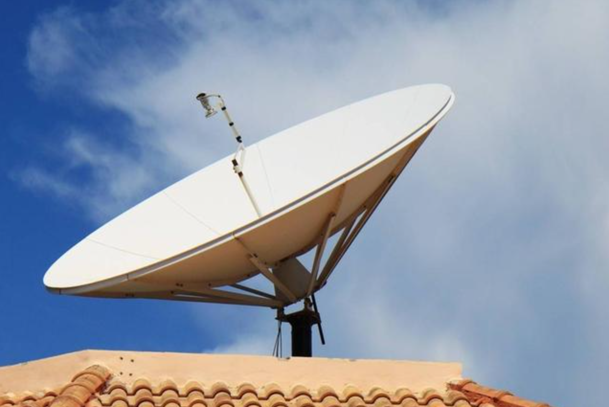

# IPTV-Never-Die

由于广电要求，各大电视家纷纷跑路于是衍生出此项目。项目内容不限于IPTV，所有一切能解决观看电视直播或者是观看电视剧的方法均在此项目行列。

## 物理方法

### 锅盖
农村里面各家各户的楼顶都有这么一个锅盖，专门用来接收电视信号的玩意儿，一次买断只需要几百块钱，要知道我们那里一年的有线电视费用为300+/年。如果家不在城市里面的话，非常推荐，不用借助各种App即可完美实现观看电视直播，家里有老人和小孩子的话也比较容易上手。

## 魔法方法

### 1、网页

- [Jackal](http://jackal.surge.sh) - 利用Next应用程序在浏览器中观看直播电视。

- [IPTV Player](https://dev-iptv.web.app/) - 开源的Flutter应用程序，允许您在浏览器中观看公开可访问的流。

- [WhatsUp TV](https://whatsuptv.app/) - IPTV (.m3u) 播放列表的播放器。

- [IPTV Stream](http://yielding-meeting.surge.sh) - 在线观看IPTV。

- [TVPeer](http://tvpeer.github.io/) - 在浏览器中在线观看点对点 (P2P) IPTV。

- [World TV Mobile](https://worldtvmobile.com/) - 搜索您喜欢的频道进行收听，并一键流媒体。

- [IPTVnator](https://iptvnator.vercel.app/) - 开源且跨平台的IPTV播放器应用程序，具有多种功能，如支持m3u和m3u8播放列表，收藏夹，电视存档/回看等。

- [VidGrid](https://vidgrid.tk.gg) - 新闻频道专注的多视图器，支持直播m3u8播放列表，YouTube和Twitch流，一键音频切换。

- [IPTV Smarter Player](http://webtv.iptvsmarters.com) - 视频流媒体播放器，允许您的IPTV客户或最终用户流式传输您提供的内容，如直播电视，视频点播，系列和电视回看。

- [Purple WebPlayer](http://login.purpletv.app) - 免费的Webplayer，可以在浏览器内流式传输内容。

- [Web TV](http://01234.fun/)  - IPTV播放器。

### 2、Windows

- [VLC for Windows](https://www.videolan.org/vlc/download-windows.html) - 免费且开源的便携式跨平台媒体播放器。

- [Kodi](https://kodi.tv/) - 具有库支持的免费跨平台媒体播放器。

- [MPC-HC](https://github.com/clsid2/mpc-hc) - 适用于Windows的免费开源视频和音频播放器。

- [PotPlayer](https://potplayer.daum.net/) - 适用于Windows的免费媒体播放器。

- [IPTVnator](https://github.com/4gray/iptvnator) - 免费的跨平台IPTV流媒体应用程序，具有多种功能，如收藏夹，电子节目指南，电视存档等。

- [termv](https://github.com/Roshan-R/termv) - 用bash编写的终端IPTV播放器。

- [Zoom Player](https://www.inmatrix.com/zplayer/) - 可定制的适用于Windows PC的媒体播放器。

### 3、macOS

- [VLC for Mac OS X](https://www.videolan.org/vlc/download-macosx.html) - 免费且开源的便携式跨平台媒体播放器。

- [IINA](https://iina.io/) - 适用于macOS的现代媒体播放器。

- [Elmedia Video Player](https://apps.apple.com/us/app/elmedia-video-player/id1044549675) - 适用于Mac OS的免费媒体播放器。

- [Kodi](https://kodi.tv/) - 具有库支持的免费跨平台媒体播放器。

- [IPTVnator](https://github.com/4gray/iptvnator) - 免费的跨平台IPTV流媒体应用程序，具有多种功能，如收藏夹，电子节目指南，电视存档等。

- [termv](https://github.com/Roshan-R/termv) - 用bash编写的终端IPTV播放器。

- [IPTV Player Live](https://apps.apple.com/us/app/iptv-player-live-watch-tv-m3u/id1662299469) - 易于使用的IPTV播放器和列表管理器，支持远程和本地M3U播放列表，画中画播放，以及基于iCloud的内容同步，以便您的其他Apple设备。

- [Opus IPTV Player](https://apps.apple.com/app/apple-store/id1592313576?pt=123343602&ct=awesome-iptv&mt=8) - 适用于所有设备（包括iOS，iPad，MacOS，Apple TV，Android和Android Tv）的跨平台IPTV播放器。

### 4、Linux

- [VLC for Linux](https://www.videolan.org/vlc/#download) - 免费且开源的便携式跨平台媒体播放器。

- [Kodi](https://kodi.tv/) - 具有库支持的免费跨平台媒体播放器。

- [Hypnotix](https://github.com/linuxmint/hypnotix) - 免费的IPTV流媒体应用程序，支持直播电视，电影和系列。

- [IPTVnator](https://github.com/4gray/iptvnator) - 免费的跨平台IPTV流媒体应用程序，具有多种功能，如收藏夹，电子节目指南，电视存档等。

- [FreetuxTV](https://github.com/freetuxtv/freetuxtv) - 互联网电视和广播播放器。

- [termv](https://github.com/Roshan-R/termv) - 用bash编写的终端IPTV播放器。

- [IPTV Desktop](https://github.com/0x0is1/iptv-desktop)  - 通过互联网在您的设备上观看来自世界各地的电视频道，完全免费。

- [pytermv](https://github.com/Ahmed-Zamouche/pytermv) - 用python编写的终端IPTV播放器。

- [yuki-iptv](https://github.com/yuki-iptv/yuki-iptv) - 支持EPG的IPTV播放器（Astroncia IPTV分支）。

### 5、IOS

- [Flex IPTV](https://apps.apple.com/ae/app/flex-iptv/id1182930255Flex) - 允许您观看基于IPTV的直播和非直播电视/流媒体技术。

- [nPlayer](https://apps.apple.com/us/app/nplayer/id1116905928) nPlayer - 媒体播放器，支持DTS (DTS HD)，DTS Headphone:X，Dolby (AC3, E-AC3)。

- [FastoTV Lite](https://apps.apple.com/us/app/fastotvlite/id1496936356) - 开源无广告的IPTV客户端，支持直播媒体，视频点播，收藏列表和电子节目指南。

- [WhatsUp TV](https://apps.apple.com/us/app/whatsup-tv/id1476950273) - IPTV (.m3u) 播放列表的播放器。

[Smarters Player Lite](https://apps.apple.com/in/app/smarters-player-lite/id1628995509)  - 视频流媒体播放器，允许您的IPTV客户或最终用户流式传输您提供的内容，如直播电视，视频点播，系列和电视回看。

- [Purple Playlist Player](https://apps.apple.com/us/app/purple-playlist-player/id1547219704) - IPTV播放器，用户可以使用他们的播放列表观看内容。

- [IPTV Player Live](https://apps.apple.com/us/app/iptv-player-live-watch-tv-m3u/id1662299469) - 免费的IPTV播放器和M3U列表管理器，支持画中画，AirPlay，Chromecast和iCloud同步，以便在iPhone，iPad，Apple TV上实现连贯的体验

- [Opus IPTV Player](https://apps.apple.com/app/apple-store/id1592313576?pt=123343602&ct=awesome-iptv&mt=8) - 适用于所有设备（包括iOS，iPad，MacOS，Apple TV，Android和Android Tv）的跨平台IPTV播放器。

### 6、Android

- [NET IP TV](https://play.google.com/store/apps/details?id=com.dnamedya.netiptv) - 适用于Android平台的IPTV播放器。

- [Kodi](https://play.google.com/store/apps/details?id=org.xbmc.kodi) - 具有库支持的免费跨平台媒体播放器。

- [KgTv Player](https://play.google.com/store/apps/details?id=tk.kgtv) - 支持质量更改，搜索，频道导出和修改的IPTV播放器。

- [VLC for Android](https://play.google.com/store/apps/details?id=org.videolan.vlc)  - 免费且开源的便携式跨平台媒体播放器。

- [MX Player](https://play.google.com/store/apps/details?id=com.mxtech.videoplayer.ad)  - 强大的视频播放器，支持高级硬件加速和字幕支持。

- [FastoTV Lite](https://play.google.com/store/apps/details?id=com.fastotv.lite) - 开源无广告的IPTV客户端，支持直播媒体，视频点播，收藏列表和电子节目指南。

- [TiviMate IPTV Player](https://play.google.com/store/apps/details?id=ar.tvplayer.tv) - 适用于Android机顶盒的IPTV播放器。

- [TVirl](https://play.google.com/store/apps/details?id=by.stari4ek.tvirl) - 特殊的Android TV输入服务，将IPTV频道集成到预安装的系统电视应用程序，如[Live Channels](https://play.google.com/store/apps/details?id=com.google.android.tv).。

- [CosmiTV Player](https://play.google.com/store/apps/details?id=com.cosmiquest.tv) - 类似于有线电视盒的IPTV播放器和DVR，适用于Android。

- [kantv](https://github.com/zhouwg/kantv) - 适用于Android的开源播放器。

- [TV.io Home Streaming](https://play.google.com/store/apps/details?id=com.player.online.tv&gl=GB) - 支持Chromcast和群聊的IPTV流媒体。

- [ProgTV Android](https://play.google.com/store/apps/details?id=com.progdvb.progtva) - 简单但方便且通用的软件，用于通过互联网或本地网络观看电视和收听广播频道。

- [OTT Navigator IPTV](https://play.google.com/store/apps/details?id=studio.scillarium.ottnavigator) - 适用于任何设备（手机，平板电脑，电视，电视盒）的免费IPTV播放器。

- [DangoPlayer](https://play.google.com/store/apps/details?id=com.aleapps.videotime) - 适用于Android的简单轻便快速的视频播放器和IPTV客户端。

- [DangoPlayer TV](https://play.google.com/store/apps/details?id=com.aleapps.videotimetv) - DangoPlayer IPTV客户端的Android TV和Google TV端口。

- [IPTV Smarters App](https://www.iptvsmarters.com/#downloads) - 视频流媒体播放器，允许您的IPTV客户或最终用户流式传输您提供的内容，如直播电视，视频点播，系列和电视回看。

- [IPTV Smart Purple Player](https://www.purplesmarttv.com/#downloads) - IPTV播放器，用户可以使用他们的播放列表观看内容。

- [Mbogi Music](https://play.google.com/store/apps/details?id=com.mbogimusic) - 一站式音频和视频应用程序，可让您访问来自世界各地的数千个免费在线广播，免费IPTV和播客。

- [Opus IPTV Player](https://play.google.com/store/apps/details?id=com.handy.opus.iptv.xtream.player&referrer=utm_source%3Dawesome-iptv%26utm_medium%3Dlink) - 适用于所有设备（包括iOS，iPad，MacOS，Apple TV，Android和Android Tv）的跨平台IPTV播放器。

- [IPTV Pro](https://play.google.com/store/apps/details?id=ru.iptvremote.android.iptv.pro)  - 适用于Android的IPTV播放器。

#### Smart TV

- [SS IPTV](https://ss-iptv.com/en) - 这是一款智能电视应用程序，为用户提供了观看IPTV的机会。

#### Apple TV

- [iPlayTV](https://apps.apple.com/us/app/iplaytv/id1072226801) - IPTV/M3U播放器，适用于Apple TV
- [IPTV Player Live](https://apps.apple.com/us/app/iptv-player-live-watch-tv-m3u/id1662299469) - 免费的IPTV播放器，支持M3U，Xtream Codes，并通过iCloud同步，实现Apple TV，iPhone，iPad和Mac之间的连贯体验。
- [Opus IPTV Player](https://apps.apple.com/app/apple-store/id1592313576?pt=123343602&ct=awesome-iptv&mt=8) - 跨平台的 IPTV 播放器：适用于所有设备，包括 iOS, iPad, MacOS, Apple TV, Android 和 Android Tv的IPTV播放器。

#### Xbox

- [Open IPTV](https://www.microsoft.com/en-us/p/open-iptv/9n9gc8l5mldm) - 一款适用于Xbox One的现代IPTV播放器。

#### Google Chrome

- [Native HLS Playback](https://chrome.google.com/webstore/detail/native-hls-playback/emnphkkblegpebimobpbekeedfgemhof) - 允许浏览器“原生”播放HLS视频URL（m3u8）。
- [EPG Viewer](https://chrome.google.com/webstore/detail/epg-viewer/lnhfllpjnichiepbkgnfhpaakhicbelh) - 在浏览器中直接查看 XMLTV 文件。